**镜像(image) :**

```shell
Docker镜像(Image)就是一个只读的模板,境像可以用来创建Docker容器,一个镜像可以创建很多容器. 就好似Java中的类和对象,类就是镜像,容器就是对象!
```

**容器(container) :**

```shell
Docker利用容器(Container)独立运行的一个或一组应用。容器是用镜像创建的运行实例。

可以被启动、开始、停止、删除。每个容器都是相互隔高的,保证安全的平台。

可以把容器看做是一个简易版的Linux环境(包括root用户权限、进程空间、用户空间和网络空间等）和运行在其中的应用程序。。

容器的定义和镜像几乎一棵一样,也是一堆层的统一视角,唯一区别在于容器的最上面那一层是可读可写的。
```

**仓库(repository)**

```shell
仓库(Repository)是集中存放镜像文件的场所。

仓库(Repository)和仓库注册服务器(Registry)是有区别的。仓库注册服务器上往往存放着多个仓库,每个仓库中又包含了多个镜像,每个镜像有不同的标签(tag)。

仓库分为公开仓库(Public)和私有仓库(Private)两种形式。

最大的公开仓库是Docker Hub(https://hub.docker.com/),存放了数量庞大的镜像供用户下载。

国内的公开仓库包括阿里云等
```

# Docker镜像讲解

## 镜像是什么

镜像是一种轻量级、可执行的独立软件包，用来打包软件运行环境和基于运行环境开发的软件，它包含运行某个软件所需的所有内容，包括代码、运行库、环境变量和配置文件。

所有的应用，直接打包docker镜像，就可以直接跑起来。

如何得到镜像：

- 从远程仓库下载
- 朋友拷贝给你
- 自己制作一个镜像 DockerFile

## Docker镜像加载原理

> UnionFS（联合文件系统）

Union(UnionFS)是一种分层、轻量级并且高性能的文件系统，**它支持文件系统的修改作为一次提交来一层层的叠加，同时可以将不同目录挂载到同一个虚拟文件系统。**Union文件系统是Docker镜像的基础。镜像可以通过分层来进行继承，基于基础镜像（没有父镜像），可以制作各种具体的应用镜像。

特性：一次同时加载多个文件系统，但从外面看起来，只能看到一个文件系统，联合加载会把各层文件系统叠加起来，这样最终的文件系统会包含所有底层的文件和目录。

> Docker镜像加载原理

docker的镜像实际上由一层一层的文件系统组成，这种度级的文件系统UnionFS.

bootfs(boot file system)主要包含bootloader和kernel, bootloader主要是引导加载kernel, Linux刚启动时会加载boofs文件系统,在Docker镜像的最底层是bootfs.这一层与我们典型的Linux/Unix系统是一样的,包含boot加载器和内核,当boot加载完成之后整个内核就都在内存中了,此时内存的使用权bootfs给内核,此时系统也会卸载bootfs.

roots (root file system) ,在boatfs之上.包含的就是典型Linux系统中的/dev, /proc, /bin, /etc等标准目录和文件.rootfs就是各种不同的操作系统发行版,比如ubuntu ,Cantos等等

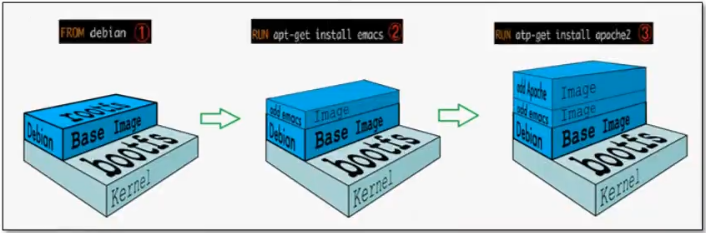

正常的centos几个G但是docker里的200多M

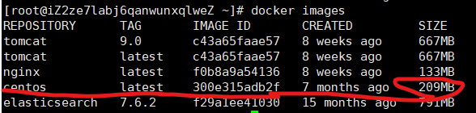

对于一个精简的OS，rootfs可以很小，只需要包含最基本的命令，工具和程序就可以了，因为底层直接用Host的kernel，自己只需要提供rootfs就可以了。

虚拟机时分钟级别，容器时秒级。

## 分层理解

> 分层的镜像

我们可以取下载一个镜像，观察日志的输出，可以看到是一层一层的在下载！

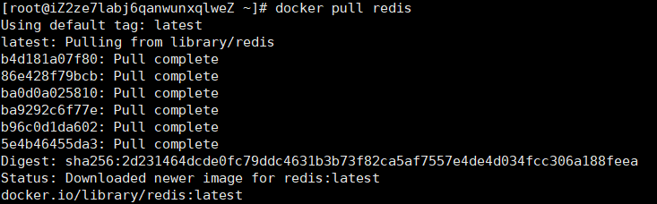

分层的最大好处就是在于，资源的共享。

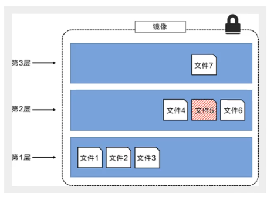

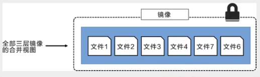

> 特点

Docker镜像都是只读的，当容器启动时，一个新的可写层被加载到镜像的顶部。

这一层就是我们通常说的容器层，容器之下的都叫镜像层。

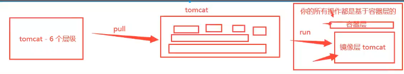

## commit镜像

```shell
docker commit 提交容器成为一个新的副本

#命令和git原理类似
docker commit -m="提交的描述信息" -a="作者" 容器id 目标镜像名:[TAG]
```

实战测试

```shell
#1.启动一个默认的tomcat

#2.发现这个默认得到tomcat是没有webapps应用的，镜像的原因，官方的镜像默认webapps下面是没有文件的

#3.自己拷贝进去基本的文件

#4.将我们操作过的容器通过commit提交为一个镜像！以后使用自己修改过的镜像即可，这就是自己一个修改的镜像
```


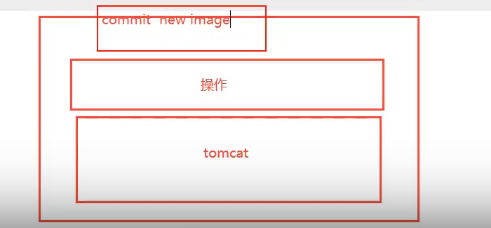


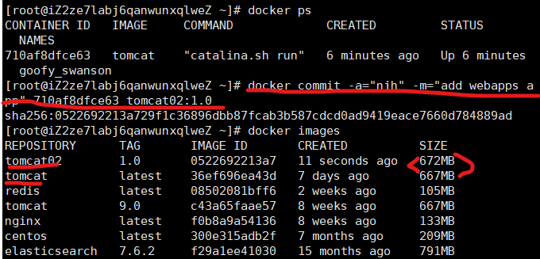

```shell
如果想要保存当前容器的状态，就可以通过commit来提交，获得一个镜像。
就好比我们以前学习vm时候，快照！
```


# 容器数据卷

## 什么是容器数据卷

**docker的理念回顾**

将应用和环境打包成一个镜像！

数据？如果数据都在容器中，那么我们容器删除，数据就会丢失

==需求：数据可以持久化且可以存储在本地==

容器之间可以有一个数据共享的技术！Docker容器中产生的数据，同步到本地。

这就是卷技术！目录的挂载，将我们容器内的目录，挂载到linux上面！

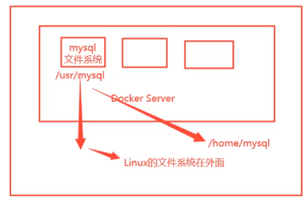

**总结：容器的持久化和同步操作！荣期间也是可以数据共享的！**


## 使用数据卷

> 方式一：直接使用命令来挂载 -v

```shell
docker run -it -v 主机目录:容器内目录

#测试 注意是绝对路径
[root@iZ2ze7labj6qanwunxqlweZ home]# docker run -it -v /home/ceshi:/home centos /bin/bash

#启动起来时候我们可以通过 docker inspect 容器id
```


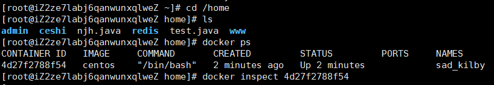

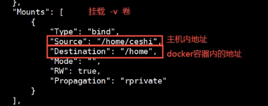

测试文件的同步（容器到宿主机 左到右）

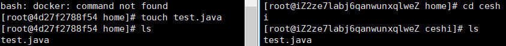

再来测试（宿主机到容器 右到左）

```shell
1.停止容器
2.宿主机上修改文件
3.启动容器
4.容器内的数据依旧同步
```

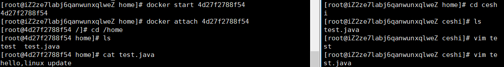

好处：我们以后修改在本地修改即可，容器内会自动同步。


## 安装MySQL

思考：MySQL的数据持久化的问题

```shell
# 获取镜像
[root@iZ2ze7labj6qanwunxqlweZ home]# docker pull mysql:5.7

#运行容器，需要做数据挂载！ #安装启动mysql，需要配置密码的，这是要注意点！
$ docker run --name some-mysql -e MYSQL_ROOT_PASSWORD=my-secret-pw -d mysql:tag

#启动mysql
-d 后台运行
-p 端口映射 宿主机:容器内的mysql
-v 卷挂载   宿主机：容器内 /home/mysql/conf:/etc/mysql/conf.d 对应映射的配置文件
           宿主机：容器内 /home/mysql/data:/var/lib/mysql    对应映射的数据
-e 环境配置
--name 容器名字
[root@iZ2ze7labj6qanwunxqlweZ home]# docker run -d -p 3310:3306 -v /home/mysql/conf:/etc/mysql/conf.d -v /home/mysql/data:/var/lib/mysql -e MYSQL_ROOT_PASSWORD=123456 --name mysql01 mysql:5.7

#启动成功后，在本地使用数据库软件（sqlyog）测试
#sqlyog-连接到服务器的3310 --- 3310 和容器的 3306映射，这个时候就可以直接连接

#在本地测试创建一个数据库，查看一下
```

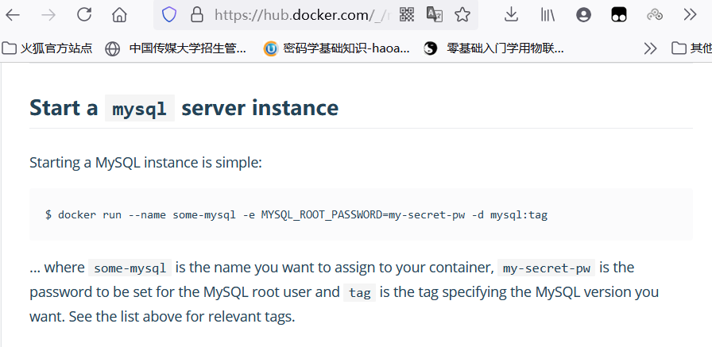

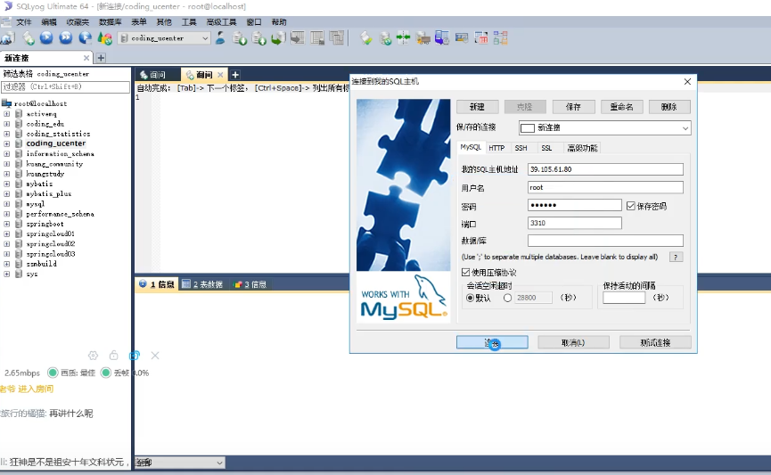

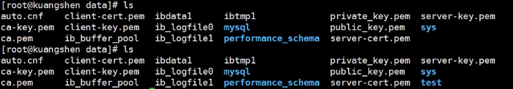

假设将容器删除

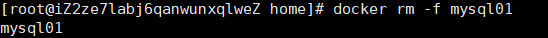

我们挂载到本地的数据卷依旧没有丢失，容器数据持久化功能。

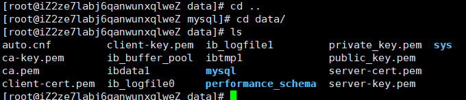


## 具名和匿名挂载

```shell
#匿名挂载
-v 容器内路径！
docker run -d -p --name nginx01 -v /etc/nginx nginx

#具名挂载
docker run -d -P --name nginx02 -v juming-nginx:/etc/nginx nginx

```

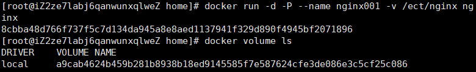

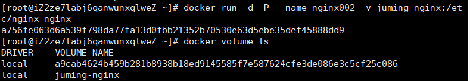

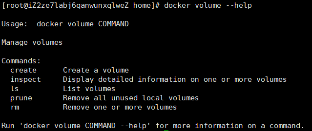

所有的docker容器内的卷，没有指定目录的情况下都在`/var/lib/docker/volumes/xxx/_data`

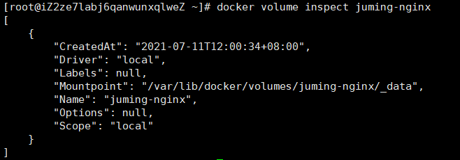

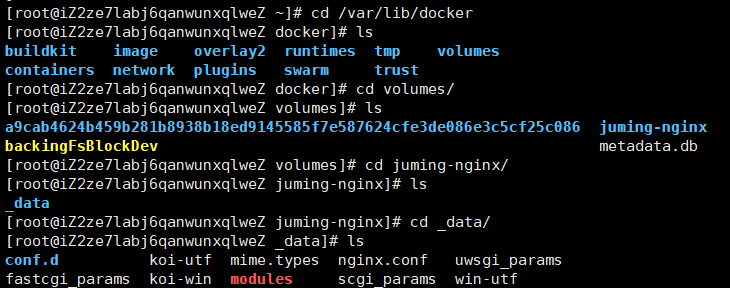

通过具名挂载可以方便的找到我们的一个卷，大多数情况下使用`具名挂载`

```shell
#如何确定是具名挂载还是匿名挂载，还是指定路径挂载。
-v 容器内路径           #匿名挂载
-v 卷名：容器内路径      #具名挂载
-v /宿主机路径:容器内路径 #指定路径挂载
```

拓展：

```shell
#通过 -v 容器内路径：ro rw 改变读写权限
ro readonly   #只读
rw readwrite  #可读可写

#一旦设置了这个容器权限，容器对我们挂载出来的内容就有限定了。
docker run -d -P --name nginx02 -v juming-nginx:/etc/nginx:ro nginx
docker run -d -P --name nginx02 -v juming-nginx:/etc/nginx:rw nginx

#ro 这个路径只能通过宿主机来操作，容器内部都是无法操作。
```


## 初识Dockerfile

> 方式二：Dockerfile

Dockerfile就是用来构建docker镜像的构建文件！命令脚本！

通过这个脚本可以生成一个镜像，镜像是一层一层的，脚本一个个的命令，每个命令都是一层。

```shell
#创建一个dockerfile文件，名字可以随机 建议 Dockerfile
#文件中的内容 指令(大写) 参数
FROM centos

VOLUME ["volume01","volume02"]    #匿名挂载

CMD echo "----end----"
CMD /bin/bash

#这里的每个命令，就是镜像的一层
```

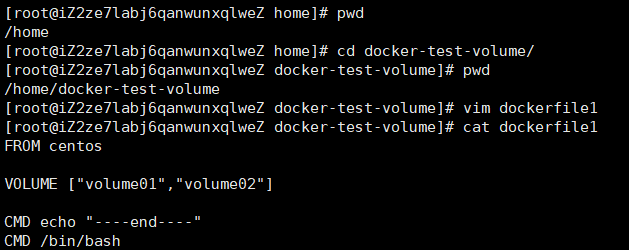

```shell
-f 地址
-t 生成文件 当前目录下加个'.'
```

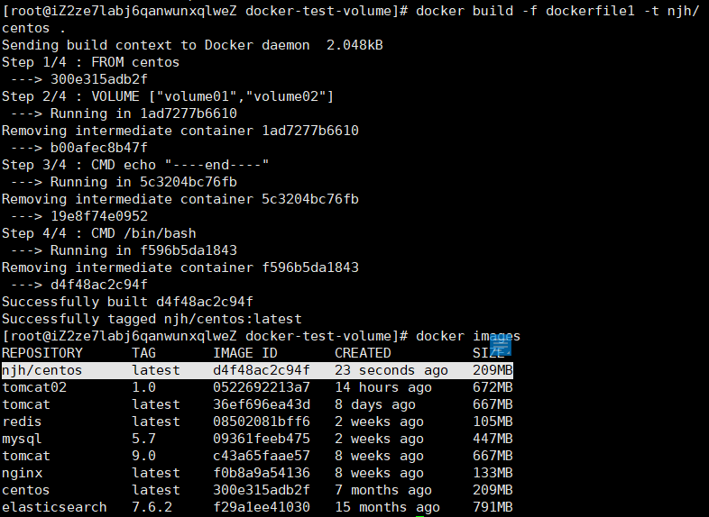

```shell
#启动自己写的容器
```

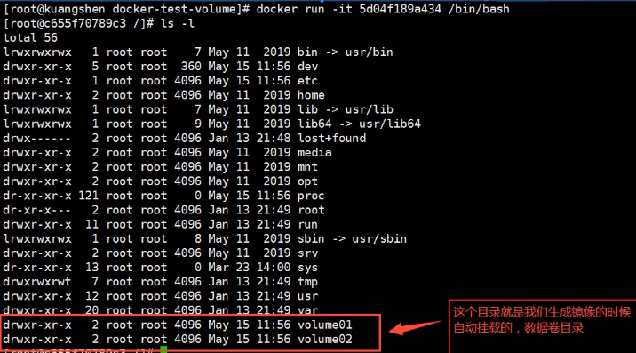

```shell
#匿名挂载，挂载的路径
[root@iZ2ze7labj6qanwunxqlweZ ~]# docker inspect 387427b57d21
```

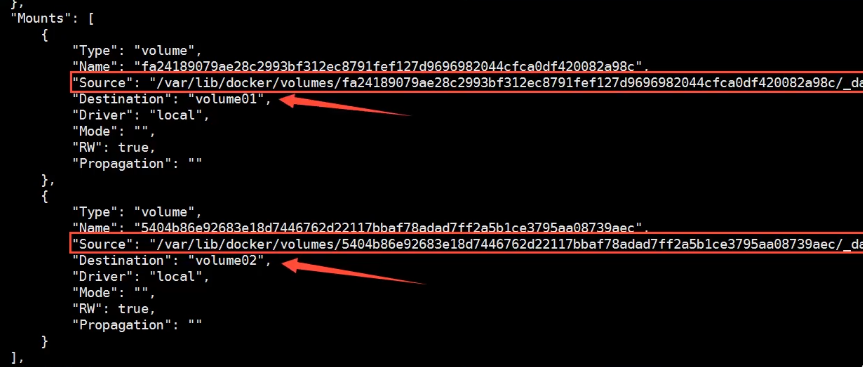

测试一下文件是否同步出去

这种方式十分常见，因为我们通常会构建自己的镜像！

假设构建镜像时没有挂载卷，要手动镜像挂载 -v 卷名:容器内路径！

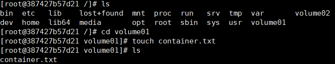

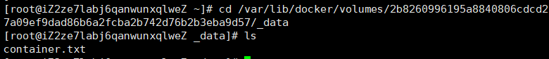


## 数据卷

两个mysql同步数据

`--volumes-from`

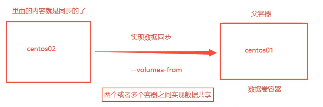

```shell
#启动3个容器，通过刚才自己写的镜像启动
```

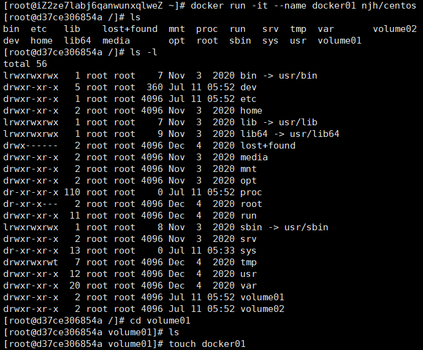

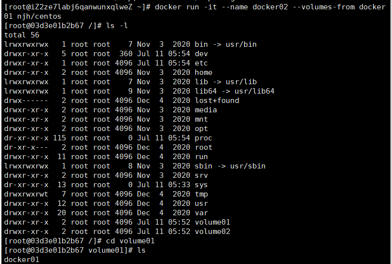

数据是可以相互共享的

`docker03 `创建

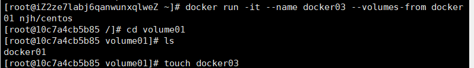

`docker01`会有

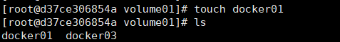

```shell
#当删除docker01，查看docker02和03还是可以访问这个文件的
#共享的 双向拷贝的概念
```

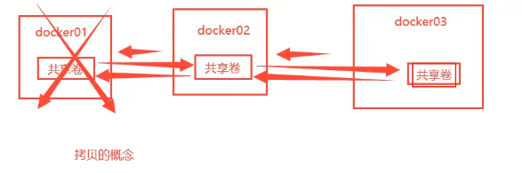

多个mysql实现数据共享，

```shell
#原来
[root@iZ2ze7labj6qanwunxqlweZ home]# docker run -d -p 3310:3306 -v /home/mysql/conf:/etc/mysql/conf.d -v /home/mysql/data:/var/lib/mysql -e MYSQL_ROOT_PASSWORD=123456 --name mysql01 mysql:5.7

#现在
[root@iZ2ze7labj6qanwunxqlweZ home]# docker run -d -p 3310:3306 -v /etc/mysql/conf.d -v /var/lib/mysql -e MYSQL_ROOT_PASSWORD=123456 --name mysql01 mysql:5.7
[root@iZ2ze7labj6qanwunxqlweZ home]# docker run -d -p 3310:3306 -e MYSQL_ROOT_PASSWORD=123456 --name mysql02 --volumes-frommy mysql01 sql:5.7

#这个时候，可以实现两个容器数据同步
```

结论：

容器之间配置信息的传递，数据卷容器的生命周期一直持续到没有容器使用为止。

但是一旦持久化到了本地，这个时候，本地的数据是不会删除的。


# DockerFile

## DockerFile介绍

dockerfile是用来构建docker镜像的文件！命令参数脚本。

构建步骤：

1、编写一个dockerfile 文件

2、docker build 构建成为一个镜像

3、docker run运行镜像

4、docker push 发布镜像（DockerHub、阿里云镜像仓库）

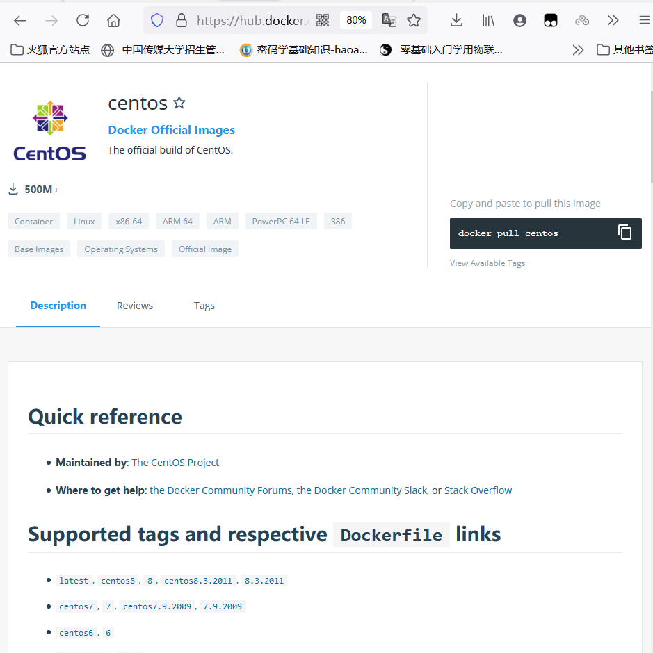

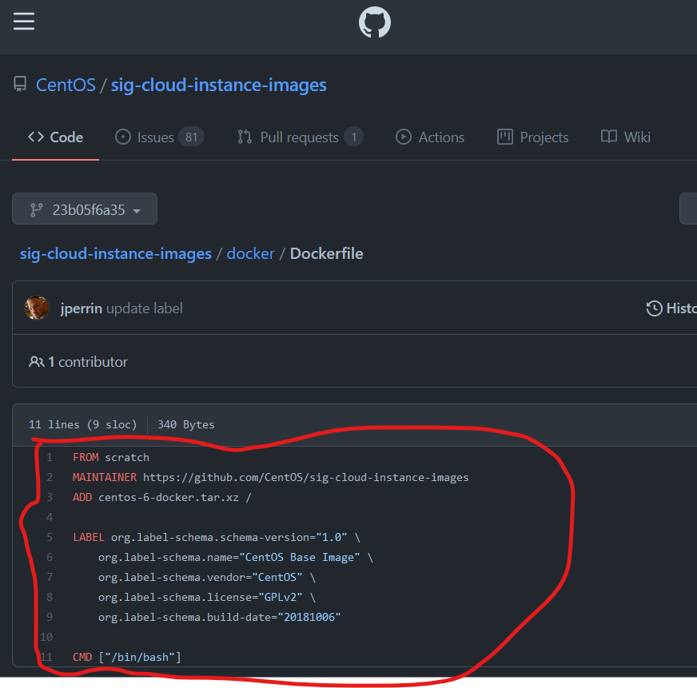

很多官方镜像都是基础包，很多功能没有，我们通常要自己去搭建


## DockerFile构建过程

1、每个保留关键字（指令）都是必须是大写字母。

2、执行从上到下顺序执行。

3、# 表示注释

4、每个指令都会创建一个新的镜像层，并提交。

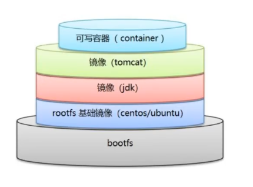

dockerfile是面向开放的，以后要发布项目，做镜像，就需要编写dockerfile文件。

Docker镜像逐渐成为企业交付的标准。

步骤：开发，部署，运维....缺一不可

DockerFile：构建文件，定义了一切的步骤，源代码

Dockerimages：通过DockerFile构建生成的镜像，最终发布和运行的产品。

Docker容器：容器就是镜像运行起来提供服务器


## DockerFile的指令

```shell
FROM        #基础镜像，一切从这里开始构建
MAINTAINER  #镜像是谁写的，姓名+邮箱
RUN         #镜像构建的时候需要运行的命令
ADD         #步骤，tomcat镜像，这个tomcat压缩包，添加内容（比如基础是centos开始构建需要tomcat）
WORKDIR     #镜像的工作目录
VOLUME      #挂载的目录
EXPOST      #暴露端口，要不然还需-p操作。
CMD         #指定这个容器启动的时候要运行的命令,只有最后一个会生效，可被替代。
ENTRYPOINT  #指定这个容器启动的时候要运行的命令，可以追加命令。
ONBUILD     #当构建一个被继承DockerFile这个时候就会运行ONBUILD的指令，触发指令。
COPY        #类似ADD，将为欧盟文件拷贝到镜像中
ENV         #构建的时候设置环境变量！
```

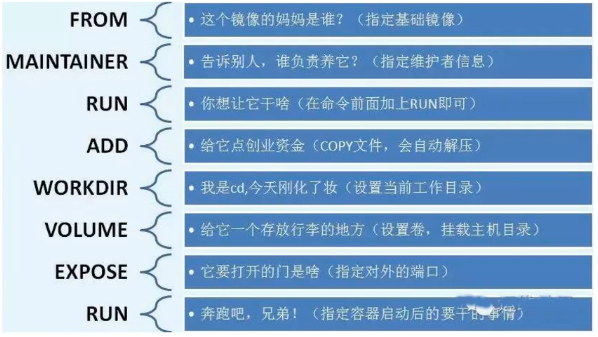

## DockerFile测试

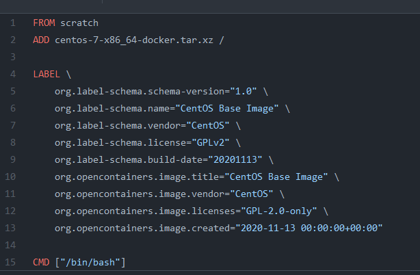

> 创建一个自己的centos

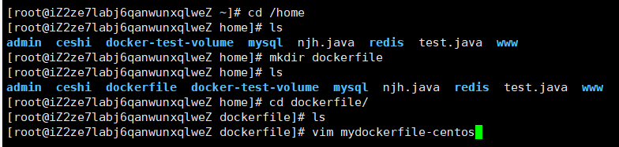

查看自己下载官网的centos发现好多命令没有，需要自己配置。

==pwd 默认进入是根目录而不是工作目录==

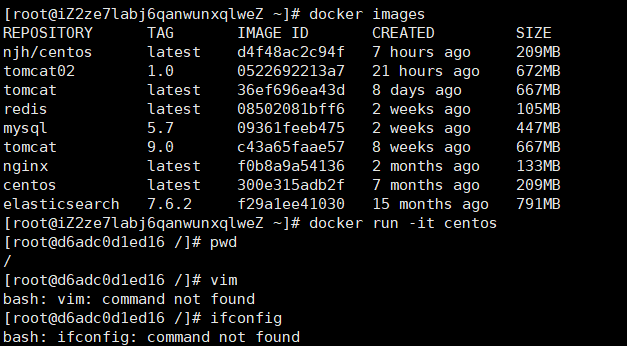

```shell
#1.编写Dockerfile文件
[root@iZ2ze7labj6qanwunxqlweZ dockerfile]# cat mydockerfile-centos 
FROM centos
MAINTAINER njh<1070015469@qq.com>

ENV MYPATH /usr/local
WORKDIR $MYPATH

RUN yum -y install vim
RUN yum -y install net-tools 

EXPOSE 80

CMD echo $MYPATH
CMD echo "---end---"
CMD /bin/bash

#2.通过这个文件构建镜像
# 命令docker build -f dockerfile文件路径 -t 镜像名:[tag]
[root@iZ2ze7labj6qanwunxqlweZ dockerfile]# docker build -f mydockerfile-centos -t mycentos:1.0 .

Successfully built 7bffd5be66cf
Successfully tagged mycentos:1.0

#3.测试运行


```

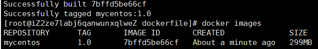

==增加后的镜像 pwd进入直接工作目录==

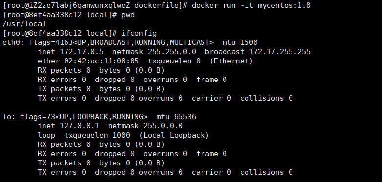

我们可以列出本地进行的变更历史 （查看是如何一步一步做起来的）

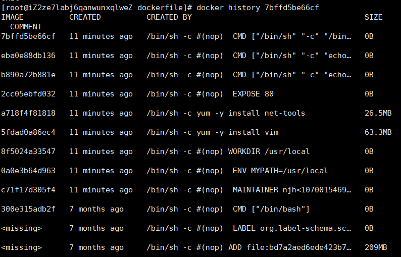

我们平时拿到一个镜像，可以研究它是怎样做的。


> CMD 和 ENTRYPOINT 区别

```shell
CMD         #指定这个容器启动的时候要运行的命令,只有最后一个会生效，可被替代。
ENTRYPOINT  #指定这个容器启动的时候要运行的命令，可以追加命令。
```

测试cmd

```shell
# 编写dockerfile文件
[root@iZ2ze7labj6qanwunxqlweZ dockerfile]# vim dockerfile-cmd-test
FROM centos
CMD ["ls","-a"]
# 构建镜像
[root@iZ2ze7labj6qanwunxqlweZ dockerfile]# docker build -f dockerfile-cmd-test -t cmdtest .
Sending build context to Docker daemon  3.072kB
Step 1/2 : FROM centos
 ---> 300e315adb2f
Step 2/2 : CMD ["ls","-a"]
 ---> Running in c2b3fff7fac9
Removing intermediate container c2b3fff7fac9
 ---> f1c731e026da
Successfully built f1c731e026da
Successfully tagged cmdtest:latest
# run运行，ls -a命令是生效的
[root@iZ2ze7labj6qanwunxqlweZ dockerfile]# docker run f1c731e026da
.
..
.dockerenv
bin
dev
etc
home
lib
lib64
lost+found
media
mnt
opt
proc
root
run
sbin
srv
sys
tmp
usr
var

#想追加一个命令 -l ls -al
[root@iZ2ze7labj6qanwunxqlweZ dockerfile]# docker run f1c731e026da -l
docker: Error response from daemon: OCI runtime create failed: container_linux.go:367: starting container process caused: exec: "-l": executable file not found in $PATH: unknown.
#上述情况是因为，cmd的清理下-l 替换了CMD ["ls","-a"]命令，-l不是命令所以报错

[root@iZ2ze7labj6qanwunxqlweZ dockerfile]# docker run f1c731e026da ls -al
total 56
drwxr-xr-x   1 root root 4096 Jul 11 13:28 .
drwxr-xr-x   1 root root 4096 Jul 11 13:28 ..
-rwxr-xr-x   1 root root    0 Jul 11 13:28 .dockerenv
lrwxrwxrwx   1 root root    7 Nov  3  2020 bin -> usr/bin
drwxr-xr-x   5 root root  340 Jul 11 13:28 dev
drwxr-xr-x   1 root root 4096 Jul 11 13:28 etc
drwxr-xr-x   2 root root 4096 Nov  3  2020 home
lrwxrwxrwx   1 root root    7 Nov  3  2020 lib -> usr/lib
lrwxrwxrwx   1 root root    9 Nov  3  2020 lib64 -> usr/lib64
drwx------   2 root root 4096 Dec  4  2020 lost+found
drwxr-xr-x   2 root root 4096 Nov  3  2020 media
drwxr-xr-x   2 root root 4096 Nov  3  2020 mnt
drwxr-xr-x   2 root root 4096 Nov  3  2020 opt
dr-xr-xr-x 105 root root    0 Jul 11 13:28 proc
dr-xr-x---   2 root root 4096 Dec  4  2020 root
drwxr-xr-x  11 root root 4096 Dec  4  2020 run
lrwxrwxrwx   1 root root    8 Nov  3  2020 sbin -> usr/sbin
drwxr-xr-x   2 root root 4096 Nov  3  2020 srv
dr-xr-xr-x  13 root root    0 Jul 11 05:33 sys
drwxrwxrwt   7 root root 4096 Dec  4  2020 tmp
drwxr-xr-x  12 root root 4096 Dec  4  2020 usr
drwxr-xr-x  20 root root 4096 Dec  4  2020 var
```

测试ENTRYPOINT

```shell
[root@iZ2ze7labj6qanwunxqlweZ dockerfile]# vim dockerfile-cmd-entrypoint
[root@iZ2ze7labj6qanwunxqlweZ dockerfile]# cat dockerfile-cmd-entrypoint 
FROM centos
ENTRYPOINT ["ls","-a"]
[root@iZ2ze7labj6qanwunxqlweZ dockerfile]# docker build -f dockerfile-cmd-entrypoint -t entrypoint-test .
Sending build context to Docker daemon  4.096kB
Step 1/2 : FROM centos
 ---> 300e315adb2f
Step 2/2 : ENTRYPOINT ["ls","-a"]
 ---> Running in ca6a2cabb19d
Removing intermediate container ca6a2cabb19d
 ---> 77a38c2de1aa
Successfully built 77a38c2de1aa
Successfully tagged entrypoint-test:latest
[root@iZ2ze7labj6qanwunxqlweZ dockerfile]# docker run 77a38c2de1aa
.
..
.dockerenv
bin
dev
etc
home
lib
lib64
lost+found
media
mnt
opt
proc
root
run
sbin
srv
sys
tmp
usr
var
#追加命令，是直接拼接在 ENTRYPOINT 命令的后面。
[root@iZ2ze7labj6qanwunxqlweZ dockerfile]# docker run 77a38c2de1aa -l
total 56
drwxr-xr-x   1 root root 4096 Jul 11 13:35 .
drwxr-xr-x   1 root root 4096 Jul 11 13:35 ..
-rwxr-xr-x   1 root root    0 Jul 11 13:35 .dockerenv
lrwxrwxrwx   1 root root    7 Nov  3  2020 bin -> usr/bin
drwxr-xr-x   5 root root  340 Jul 11 13:35 dev
drwxr-xr-x   1 root root 4096 Jul 11 13:35 etc
drwxr-xr-x   2 root root 4096 Nov  3  2020 home
lrwxrwxrwx   1 root root    7 Nov  3  2020 lib -> usr/lib
lrwxrwxrwx   1 root root    9 Nov  3  2020 lib64 -> usr/lib64
drwx------   2 root root 4096 Dec  4  2020 lost+found
drwxr-xr-x   2 root root 4096 Nov  3  2020 media
drwxr-xr-x   2 root root 4096 Nov  3  2020 mnt
drwxr-xr-x   2 root root 4096 Nov  3  2020 opt
dr-xr-xr-x 105 root root    0 Jul 11 13:35 proc
dr-xr-x---   2 root root 4096 Dec  4  2020 root
drwxr-xr-x  11 root root 4096 Dec  4  2020 run
lrwxrwxrwx   1 root root    8 Nov  3  2020 sbin -> usr/sbin
drwxr-xr-x   2 root root 4096 Nov  3  2020 srv
dr-xr-xr-x  13 root root    0 Jul 11 05:33 sys
drwxrwxrwt   7 root root 4096 Dec  4  2020 tmp
drwxr-xr-x  12 root root 4096 Dec  4  2020 usr
drwxr-xr-x  20 root root 4096 Dec  4  2020 var

如果需要打出完整命令的就是CMD
可以直接进行拼接的是ENTRYPOINT
```

Dockerfile中很多命令十分相似，我们需要去了解他们。


## 做一个Tomcat镜像

1.准备镜像文件 tomcat 压缩包，jdk的压缩包。

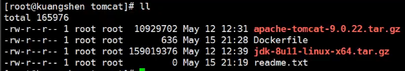

2.编写dockerfile文件，官方命名`Dockerfile`，build会自动寻找这个文件，就不需要-f指定了。

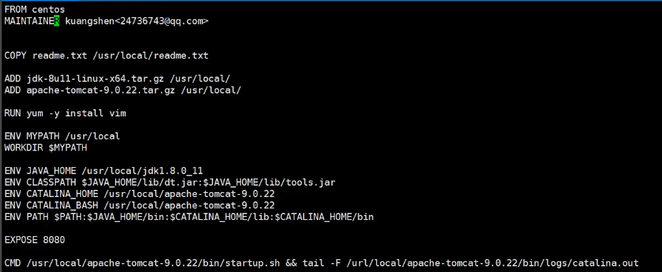

3.构建镜像 docker build  作者进行了两次挂载

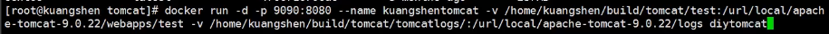

4.启动镜像

5.访问测试

6.发布项目（由于做了卷挂载，可以直接在本地编写项目就可以发布了）


##  发布自己的镜像

> DockerHub

1.地址https://hub.docker.com/注册自己的账号。

2.确定这个账号可以登陆

3.在我们服务器上提交自己的镜像

```shell
先登陆再提交
[root@iZ2ze7labj6qanwunxqlweZ dockerfile]# docker login --help

Usage:  docker login [OPTIONS] [SERVER]

Log in to a Docker registry.
If no server is specified, the default is defined by the daemon.

Options:
  -p, --password string   Password
      --password-stdin    Take the password from stdin
  -u, --username string   Username
  
[root@iZ2ze7labj6qanwunxqlweZ dockerfile]# docker login -u lnjh
Password: 
WARNING! Your password will be stored unencrypted in /root/.docker/config.json.
Configure a credential helper to remove this warning. See
https://docs.docker.com/engine/reference/commandline/login/#credentials-store

Login Succeeded
```

4.登陆完毕后可以提交镜像了，就是一步 docker push 带上版本号

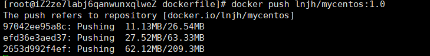


> 阿里云镜像服务

**参考官方文档**

1.登陆阿里云

2.找到容器镜像服务

3.创建命名空间

4.创建容器镜像

5.浏览阿里云给的教程


## 小结

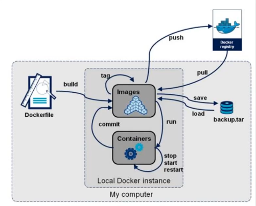


# Docker网络

```shell
#删除所有镜像
[root@iZ2ze7labj6qanwunxqlweZ ~]# docker rm -f $(docker ps -aq)
#删除所有容器
[root@iZ2ze7labj6qanwunxqlweZ ~]# docker rmi -f $(docker images -aq)
```

## 理解Docker0

Linux获取当前ip地址：

1.本地回环地址 2.阿里云内网地址 3.docker0地址


三个网络

```shell
#问题，docker是如何处理容器网络访问的？
```


```shell
[root@iZ2ze7labj6qanwunxqlweZ ~]# docker run -d -P --name tomcat01 tomcat

#查看容器的内部网络地址 ip addr ，发现容器启动的时候会得到一个 eth0@if59 ip地址，docker分配的！
[root@iZ2ze7labj6qanwunxqlweZ ~]# docker exec -it tomcat01 ip addr
1: lo: <LOOPBACK,UP,LOWER_UP> mtu 65536 qdisc noqueue state UNKNOWN group default qlen 1000
    link/loopback 00:00:00:00:00:00 brd 00:00:00:00:00:00
    inet 127.0.0.1/8 scope host lo
       valid_lft forever preferred_lft forever
58: eth0@if59: <BROADCAST,MULTICAST,UP,LOWER_UP> mtu 1500 qdisc noqueue state UP group default 
    link/ether 02:42:ac:11:00:02 brd ff:ff:ff:ff:ff:ff link-netnsid 0
    inet 172.17.0.2/16 brd 172.17.255.255 scope global eth0
       valid_lft forever preferred_lft forever

#思考，linux能不能ping通容器内部
[root@iZ2ze7labj6qanwunxqlweZ ~]# ping 172.17.0.2

#Linux可以ping同docker容器内部
```

> 原理

1、每启动一个docker容器，docker就会给docker容器分配一个ip，只要安装了docker，就会有一个网卡docker0 桥接模式，使用的技术是 evth-pair 技术。

再次测试 ip addr


2、再启动一个容器测试 发现又多了一个


```shell
#我们发现这个容器带来的网卡，都是一对一对的
#evth-pair 就是一对的虚拟设备接口，他们都是成对出现的，一端连着协议，一端彼此相连。
#正因为有这个特性，evth-pair 充当一个桥梁，连接各种虚拟网络设备的
#OpenStac，Docker容器之间的连接，OVS的连接，都是使用evth-pair技术
```

3、测试一下tomcat 01和tomcat 02是否可以ping通

```shell
[root@iZ2ze7labj6qanwunxqlweZ ~]# docker exec -it tomcat02 ping 172.17.0.2

#结论:容器和容器之间是可以相互ping通的。
```


结论：tomcat01和tomcat02是公用的一个路由器，docker0.

所有的容器不指定网络的情况下，都是docker0路由的，docker会给我们的容器分配一个默认的可用的IP。

> 小结

docker使用的linux桥接，宿主机中docker容器的网桥 docker0   Veth改为evth


只要容器删除，对应的网桥就没了。

 

## --link

项目不重启，数据库ip换掉了，可以通过名字来进行访问容器？（高可用）

```shell
[root@iZ2ze7labj6qanwunxqlweZ ~]# docker exec -it tomcat02 ping tomcat01
ping: tomcat01: Name or service not known

#如何可以解决呢？ 通过 --link
[root@iZ2ze7labj6qanwunxqlweZ ~]# docker run -d -P --name tomcat03 --link tomcat02 tomcat
fcda5b98d5b48ad566a9dcc683f47879cb3e03806e5f54742cfa5d2f485247bd
[root@iZ2ze7labj6qanwunxqlweZ ~]# docker exec -it tomcat03 ping tomcat02
PING tomcat02 (172.17.0.3) 56(84) bytes of data.
64 bytes from tomcat02 (172.17.0.3): icmp_seq=1 ttl=64 time=0.119 ms
64 bytes from tomcat02 (172.17.0.3): icmp_seq=2 ttl=64 time=0.118 ms
64 bytes from tomcat02 (172.17.0.3): icmp_seq=3 ttl=64 time=0.092 ms

#反向可以ping通吗？ 不可以
[root@iZ2ze7labj6qanwunxqlweZ ~]# docker exec -it tomcat02 ping tomcat03
ping: tomcat03: Name or service not known

```


inspect命令


其实这个tomcat03就是在本地配置了tomcat02的配置

```shell
# 查看hosts配置。 tomcat03配置了tomcat02
[root@iZ2ze7labj6qanwunxqlweZ ~]# docker exec -it tomcat03 cat /etc/hosts
127.0.0.1	localhost
::1	localhost ip6-localhost ip6-loopback
fe00::0	ip6-localnet
ff00::0	ip6-mcastprefix
ff02::1	ip6-allnodes
ff02::2	ip6-allrouters
172.17.0.3	tomcat02 091fb851567a
172.17.0.4	fcda5b98d5b4
```

本质：--link 就是我们在hosts配置中增加了一个映射

需要双向的link，现在不建议使用。


## 自定义网络

> 查看所有的docker模式


**网络模式**

bridge：桥接模式(默认)    通过docker上面搭桥  自己创建也是用桥接模式

none：不配置网络

host：和宿主机共享网络

container：容器网络连通！（用的少）

```shell
[root@iZ2ze7labj6qanwunxqlweZ ~]# docker network --help

Usage:  docker network COMMAND

Manage networks

Commands:
  connect     Connect a container to a network
  create      Create a network
  disconnect  Disconnect a container from a network
  inspect     Display detailed information on one or more networks
  ls          List networks
  prune       Remove all unused networks
  rm          Remove one or more networks

Run 'docker network COMMAND --help' for more information on a command.
```

**测试**

```shell
#我们之前直接启动的命令 --net bridge 这个就是docker0
docker run -d -P --name tomcat01 tomcat （原来的 默认bridge 下面的命令）
docker run -d -P --name tomcat01 net bridge tomcat

#docker0特点 默认 域名不能访问  --link可以打通连接

#我们可以自定义一个网络
#--driver bridge             桥接
#--subnet 192.168.0.0/16     子网
#--gateway 192.168.0.1       网关
#mynet                      网络名字(连接方式 自己取的名字)
[root@iZ2ze7labj6qanwunxqlweZ ~]# docker network create --driver bridge --subnet 192.168.0.0/16 --gateway 192.168.0.1 mynet
db3bca046052d0cf910cafee7eb64a25c061776e2cbb786cc0c685e22d3c199f
[root@iZ2ze7labj6qanwunxqlweZ ~]# docker network ls
NETWORK ID     NAME      DRIVER    SCOPE
0b26437f03aa   bridge    bridge    local
75113e31453b   host      host      local
db3bca046052   mynet     bridge    local
3920ee516e36   none      null      local
```

自己的网络创建好了


```shell
[root@iZ2ze7labj6qanwunxqlweZ ~]# docker run -d -P --name tomcat-net-01 --net mynet tomcat
f613b3e1946a411b05ce924a8bb1988037d7705f0ceeb030c6942fcc5b815f82
[root@iZ2ze7labj6qanwunxqlweZ ~]# docker run -d -P --name tomcat-net-02 --net mynet tomcat
9efacd476d3b47d26e6a7c06c4e2010466d2bca1782d7bcfe0ae5fa8ddcb142c
[root@iZ2ze7labj6qanwunxqlweZ ~]# docker network inspect mynet
[
    {
        "Name": "mynet",
        "Id": "db3bca046052d0cf910cafee7eb64a25c061776e2cbb786cc0c685e22d3c199f",
        "Created": "2021-07-12T17:11:01.173904715+08:00",
        "Scope": "local",
        "Driver": "bridge",
        "EnableIPv6": false,
        "IPAM": {
            "Driver": "default",
            "Options": {},
            "Config": [
                {
                    "Subnet": "192.168.0.0/16",
                    "Gateway": "192.168.0.1"
                }
            ]
        },
        "Internal": false,
        "Attachable": false,
        "Ingress": false,
        "ConfigFrom": {
            "Network": ""
        },
        "ConfigOnly": false,
        "Containers": {
            "9efacd476d3b47d26e6a7c06c4e2010466d2bca1782d7bcfe0ae5fa8ddcb142c": {
                "Name": "tomcat-net-02",
                "EndpointID": "89bfcf7a3e7dfff9b22687ad36574c2c227a2b5c247ec3eeca4c3d0099de7149",
                "MacAddress": "02:42:c0:a8:00:03",
                "IPv4Address": "192.168.0.3/16",
                "IPv6Address": ""
            },
            "f613b3e1946a411b05ce924a8bb1988037d7705f0ceeb030c6942fcc5b815f82": {
                "Name": "tomcat-net-01",
                "EndpointID": "bd061a9891290583c625bd7bebb8e021cccaef5ee8a58392514652cfff6edea7",
                "MacAddress": "02:42:c0:a8:00:02",
                "IPv4Address": "192.168.0.2/16",
                "IPv6Address": ""
            }
        },
        "Options": {},
        "Labels": {}
    }
]

#再次测试 两个相互可以ping通
[root@iZ2ze7labj6qanwunxqlweZ ~]# docker exec -it tomcat-net-01 ping 192.168.0.3
PING 192.168.0.3 (192.168.0.3) 56(84) bytes of data.
64 bytes from 192.168.0.3: icmp_seq=1 ttl=64 time=0.135 ms
64 bytes from 192.168.0.3: icmp_seq=2 ttl=64 time=0.095 ms
^C
--- 192.168.0.3 ping statistics ---
2 packets transmitted, 2 received, 0% packet loss, time 1000ms
rtt min/avg/max/mdev = 0.095/0.115/0.135/0.020 ms

#现在不使用 --link也可以ping名字
[root@iZ2ze7labj6qanwunxqlweZ ~]# docker exec -it tomcat-net-01 ping tomcat-net-02
PING tomcat-net-02 (192.168.0.3) 56(84) bytes of data.
64 bytes from tomcat-net-02.mynet (192.168.0.3): icmp_seq=1 ttl=64 time=0.072 ms
64 bytes from tomcat-net-02.mynet (192.168.0.3): icmp_seq=2 ttl=64 time=0.093 ms
^C
--- tomcat-net-02 ping statistics ---
2 packets transmitted, 2 received, 0% packet loss, time 2ms
rtt min/avg/max/mdev = 0.072/0.082/0.093/0.013 ms
```

自定义的网络docker都已经帮我们维护好了对应的关系，推荐平时这样使用网络。

好处： 

redis - 不同的集群使用不同的网络，保证集群是安全和健康的

mysql - 不同的集群使用不同的网络，保证集群是安全和健康的


## 网络连通


networ 网络    container 容器名


```shell
# 测试打通 tomcat01 - mynet

# 连通之后就是将 tomcat01 放到 mynet网络下

#一个容器两个ip地址
#阿里云服务，公网ip，私网ip。


#连接
[root@iZ2ze7labj6qanwunxqlweZ ~]# docker network connect mynet tomcat01
#查看网络信息
[root@iZ2ze7labj6qanwunxqlweZ ~]# docker network inspect mynet
```


```shell
#01连同了
[root@iZ2ze7labj6qanwunxqlweZ ~]# docker exec -it tomcat01 ping tomcat-net-01
PING tomcat-net-01 (192.168.0.2) 56(84) bytes of data.
64 bytes from tomcat-net-01.mynet (192.168.0.2): icmp_seq=1 ttl=64 time=0.094 ms
64 bytes from tomcat-net-01.mynet (192.168.0.2): icmp_seq=2 ttl=64 time=0.102 ms
64 bytes from tomcat-net-01.mynet (192.168.0.2): icmp_seq=3 ttl=64 time=0.084 ms
```


结论：假设要跨网络操作，需要使用docker network connect 连通!


# Docker Compose

## 简介

Docker

DockerFile -> bulid（形成镜像）-> run  （100个微服务，就需要100次的手动操作）

Docker Compose 就可以轻松高效的来管理这些容器，以及定义和运行容器。

[官方文档](https://docs.docker.com/compose/)

> 官方介绍

定义运行多个容器

YAML file 配置文件

single command 简单命令 有哪些？

Compose is a tool for defining and running multi-container Docker  applications. With Compose, you use a YAML file to configure your  application’s services. Then, with a single command, you create and  start all the services from your configuration. To learn more about all  the features of Compose, see the list of features.

所有环境都可以使用 Docker Compose  production、development、staging、testing
Compose works in all environments: production, staging, development, testing,  as well as CI workflows. You can learn more about each case in Common  Use Cases.

**三步骤：**

Using Compose is basically a three-step process:
1.Define your app’s environment with a `Dockerfile` so it can be reproduced anywhere.

- Dockerfile保证我们的项目在任何地方可以运行

2.Define the services that make up your app in `docker-compose.yml` so they can be run together in an isolated environment.

- services 什么是服务？

- docker-compose.yml 这个文件如何写？

3.Run `docker compose up` and the Docker compose command starts and runs your  entire app. You can alternatively run docker-compose up using the  docker-compose binary.

- 启动项目  和docker run 类似

作用：批量容器编排

> 自己的理解

compose是Docker官方的开源项目，需要安装。

 `Dockerfile`  让程序在任何地方运行。 web服务。 redis、mysql、nginx...多个容器。

compose解决

```yaml
version: "3.9"  # optional since v1.27.0
services:
  web:
    build: .
    ports:
      - "5000:5000"
    volumes:
      - .:/code
      - logvolume01:/var/log
    links:
      - redis
  redis:
    image: redis
volumes:
  logvolume01: {}

```

compose：重要概念

- 服务services：容器，应用 （web，redis，mysql。。。。）

- 项目project：一组关连的容器。 如开源博客 （web + mysql。。。。）

## 安装

1、下载

```shell
sudo curl -L "https://github.com/docker/compose/releases/download/1.29.2/docker-compose-$(uname -s)-$(uname -m)" -o /usr/local/bin/docker-compose
#下面的国内镜像快一些
curl -L https://get.daocloud.io/docker/compose/releases/download/1.29.2/docker-compose-`uname -s`-`uname -m` > /usr/local/bin/docker-compose
```


2、授权

```shell
sudo chmod +x /usr/local/bin/docker-compose
```


## 演示

官网给的步骤实践一遍：https://docs.docker.com/compose/gettingstarted/

```shell
#下载
[root@iZ2ze7labj6qanwunxqlweZ ~]# curl -L https://get.daocloud.io/docker/compose/releases/download/1.29.2/docker-compose-`uname -s`-`uname -m` > /usr/local/bin/docker-compose
  % Total    % Received % Xferd  Average Speed   Time    Time     Time  Current
                                 Dload  Upload   Total   Spent    Left  Speed
100   423  100   423    0     0    478      0 --:--:-- --:--:-- --:--:--   479
100 12.1M  100 12.1M    0     0  5240k      0  0:00:02  0:00:02 --:--:-- 9112k
[root@iZ2ze7labj6qanwunxqlweZ ~]# cd /usr/local/bin
[root@iZ2ze7labj6qanwunxqlweZ bin]# ll
total 13152
-rw-r--r-- 1 root root 12737304 Jul 12 20:40 docker-compose
-rwxr-xr-x 1 root root     1758 May  3 17:14 jemalloc-config
-rwxr-xr-x 1 root root      145 May  3 17:14 jemalloc.sh
-rwxr-xr-x 1 root root   179069 May  3 17:14 jeprof
-rwxr-xr-x 1 root root     1461 Jun 14  2017 libmcrypt-config
lrwxrwxrwx 1 root root       12 May  3 17:15 luajit -> luajit-2.0.4
-rwxr-xr-x 1 root root   449360 May  3 17:15 luajit-2.0.4
-rwxr-xr-x 1 root root    83224 Jun 14  2017 mcrypt
lrwxrwxrwx 1 root root        6 May  3 17:11 mdecrypt -> mcrypt
[root@iZ2ze7labj6qanwunxqlweZ bin]# sudo chmod +x docker-compose
[root@iZ2ze7labj6qanwunxqlweZ bin]# docker-compose version
docker-compose version 1.29.2, build 5becea4c
docker-py version: 5.0.0
CPython version: 3.7.10
OpenSSL version: OpenSSL 1.1.0l  10 Sep 2019
[root@iZ2ze7labj6qanwunxqlweZ bin]# cd /home
[root@iZ2ze7labj6qanwunxqlweZ home]# clear
[root@iZ2ze7labj6qanwunxqlweZ home]# ll
total 28
drwx------ 3 admin admin 4096 May  3 16:15 admin
drwxr-xr-x 2 root  root  4096 Jul 11 10:59 ceshi
drwxr-xr-x 2 root  root  4096 Jul 11 21:33 dockerfile
drwxr-xr-x 2 root  root  4096 Jul 11 13:24 docker-test-volume
drwxr-xr-x 4 root  root  4096 Jul 11 11:20 mysql
-rw-r--r-- 1 root  root     0 May 14 14:11 njh.java
drwx------ 2 redis redis 4096 May  3 17:24 redis
-rw-r--r-- 1 root  root     0 May 14 14:13 test.java
drwx------ 3 www   www   4096 May  3 17:23 www
#演示
[root@iZ2ze7labj6qanwunxqlweZ home]# mkdir composetest
[root@iZ2ze7labj6qanwunxqlweZ home]# cd composetest
[root@iZ2ze7labj6qanwunxqlweZ composetest]# ll
total 0
[root@iZ2ze7labj6qanwunxqlweZ composetest]# vim app.py
[root@iZ2ze7labj6qanwunxqlweZ composetest]# ll
total 4
-rw-r--r-- 1 root root 516 Jul 12 20:47 app.py
[root@iZ2ze7labj6qanwunxqlweZ composetest]# vim requirements.txt
[root@iZ2ze7labj6qanwunxqlweZ composetest]# vim Dockerfile
[root@iZ2ze7labj6qanwunxqlweZ composetest]# cat Dockerfile
# syntax=docker/dockerfile:1
FROM python:3.7-alpine
WORKDIR /code
ENV FLASK_APP=app.py
ENV FLASK_RUN_HOST=0.0.0.0
RUN apk add --no-cache gcc musl-dev linux-headers
COPY requirements.txt requirements.txt
RUN pip install -r requirements.txt
EXPOSE 5000
COPY . .
CMD ["flask", "run"]

[root@iZ2ze7labj6qanwunxqlweZ composetest]# vim docker-compose.yml
[root@iZ2ze7labj6qanwunxqlweZ composetest]# ll
total 16
-rw-r--r-- 1 root root 516 Jul 12 20:47 app.py
-rw-r--r-- 1 root root 112 Jul 12 20:51 docker-compose.yml
-rw-r--r-- 1 root root 282 Jul 12 20:50 Dockerfile
-rw-r--r-- 1 root root  12 Jul 12 20:48 requirements.txt
[root@iZ2ze7labj6qanwunxqlweZ composetest]# docker-compose up
```


```shell
1. 应用 app.py 设置
2. Dockerfile 应用打包为镜像
3. docker-compose.yml文件 （定义整个服务，需要的环境，web，redis） 完整的上线服务
4. 启动compose项目 （docker-compose up）
```

流程：

```shell
1. 创建网络
2. 执行docker-compose.yml
3. 启动服务
```

文件名：composetest

服务名：

```yaml
version: "3.9"
services:
  web:
    build: .
    ports:
      - "5000:5000"
  redis:
    image: "redis:alpine"
```


自动的默认规则：

访问一次5000端口 就会增加一次次数


docker images 发现镜像都自己下载了 （不用一个一个run）


composetest_web_1、composetest_redis_1为什么有个1...会不会有123？

默认的服务名 文件名 _ 服务名 _ num

多个服务器。集群。可能在服务器A也可能在B _num 是指副本数量

如下图服务redis服务=>4个副本  1.2.3.4.

集群状态。服务都不可能只要一个运行实列redis 如果宕机了就挂了 要有弹性


3、网络规则


项目中的所有内容都在同一个网络下，可以域名访问。


如果在同一个网络下，我们可以直接通过域名访问。 `app.py`


停止：

docker-compose down 或者 ctrl + c

docker-compose通过编写docker-compose yml文件  可以通过compose一键启动或者停止！


## yaml规则

官方配置文档：https://docs.docker.com/compose/compose-file/compose-file-v3/#depends_on

```yaml
# 核心就3层

#第一层
version: "3.9" #版本
#第二层
services:      #服务
  web：    #服务一
   images：#服务中的配置
   bulid：
   ports:
   network：
   ...
  redis:   #服务二
   ...
  mysql：  #服务三
   ...
#第三层 其他配置 网络、数据卷、全局配置
networks:
  frontend:
  backend:
volumes: 
  db-data:
configs：
```

依赖，当web服务依赖于redis时，需要设置depends_on


还需要多看 官方文档和开源项目的一些yaml文件


运用[docker 给的wordpass文档](https://docs.docker.com/samples/wordpress/)搭建博客

http://39.102.36.85:8000

