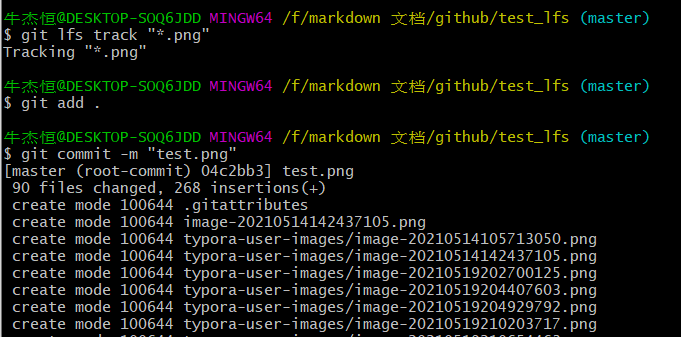
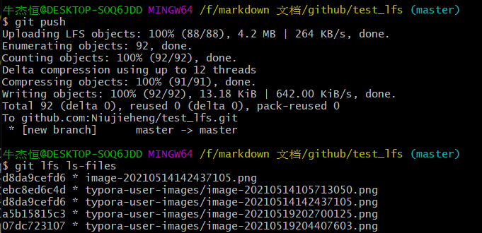
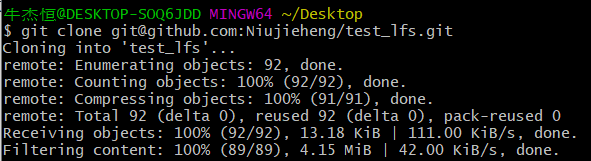
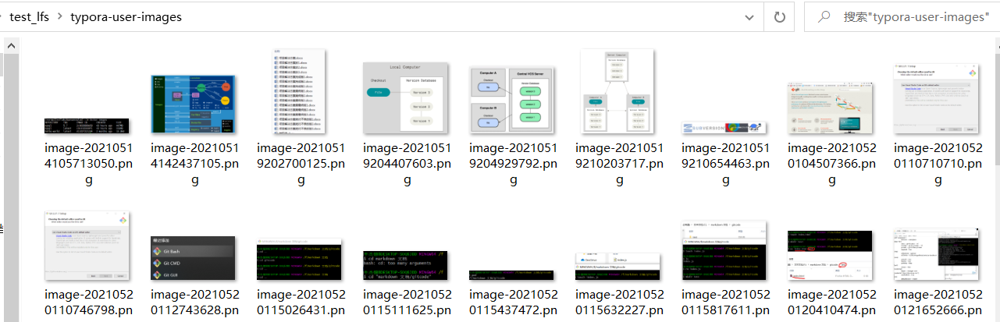
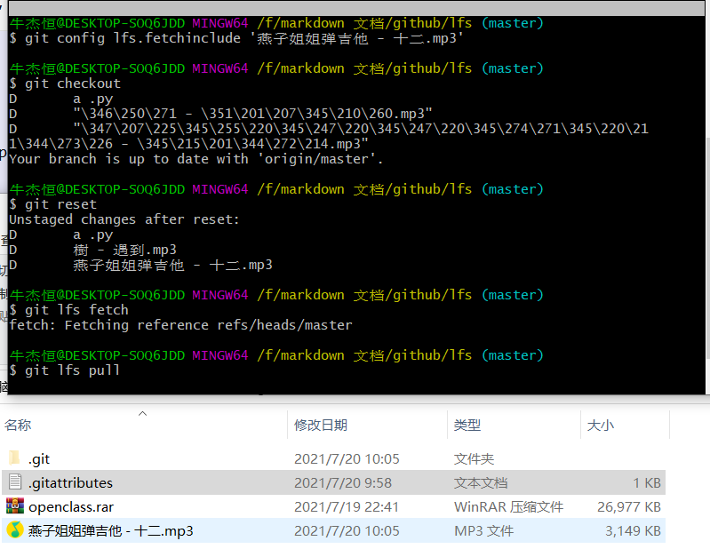
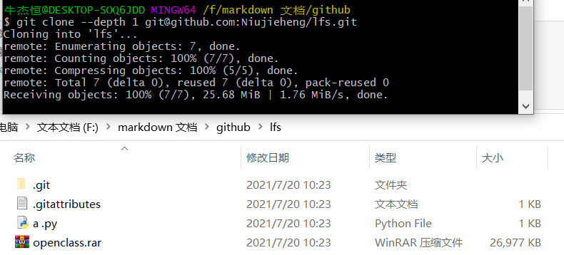

# 关于LFS

查找[官方文档](https://github.com/git-lfs/git-lfs/blob/main/docs/README.md) 包括官方手册页、大文件处理的视频和规范。

```bash
# 查看当前使用 Git LFS 管理的匹配列表
git lfs track

# 使用 Git LFS 管理指定的文件
git lfs track "*.png"

# 不再使用 Git LFS 管理指定的文件
git lfs untrack "*.png"

# 类似 `git status`，查看当前 Git LFS 对象的状态
git lfs status

# 枚举目前所有被 Git LFS 管理的具体文件
git lfs ls-files

# 检查当前所用 Git LFS 的版本
git lfs version
```






​		目前最新版本的 `git clone` 已经能够提供与 `git lfs clone` 一致的性能，因此可以直接使用`git clone`.






```bash
#通过git帮助搜索到的关于lfs命令

牛杰恒@DESKTOP-SOQ6JDD MINGW64 /f/markdown 文档/github/test_lfs (master)
$ git lfs help
git lfs <command> [<args>]

Git LFS is a system for managing and versioning large files in
association with a Git repository.  Instead of storing the large files
within the Git repository as blobs, Git LFS stores special "pointer
files" in the repository, while storing the actual file contents on a
Git LFS server.  The contents of the large file are downloaded
automatically when needed, for example when a Git branch containing
the large file is checked out.

Git LFS works by using a "smudge" filter to look up the large file
contents based on the pointer file, and a "clean" filter to create a
new version of the pointer file when the large file's contents change.
It also uses a pre-push hook to upload the large file contents to
the Git LFS server whenever a commit containing a new large file
version is about to be pushed to the corresponding Git server.

Commands
--------

Like Git, Git LFS commands are separated into high level ("porcelain")
commands and low level ("plumbing") commands.

High level commands
--------------------
* git lfs env:       
    Display the Git LFS environment.
* git lfs checkout:  
    Populate working copy with real content from Git LFS files.
* git lfs dedup:     
    De-duplicate Git LFS files.
* git lfs ext:
    Display Git LFS extension details.
* git lfs fetch:
    Download Git LFS files from a remote.
* git lfs fsck:
    Check Git LFS files for consistency.
* git lfs install:
    Install Git LFS configuration.
* git lfs lock:
    Set a file as "locked" on the Git LFS server.
* git lfs locks:
    List currently "locked" files from the Git LFS server.
* git lfs logs:
    Show errors from the Git LFS command.
* git lfs ls-files:
    Show information about Git LFS files in the index and working tree.
* git lfs migrate:
    Migrate history to or from Git LFS
* git lfs prune:
    Delete old Git LFS files from local storage
* git lfs pull:
    Fetch Git LFS changes from the remote & checkout any required working tree
    files.
* git lfs push:
    Push queued large files to the Git LFS endpoint.
* git lfs status:
    Show the status of Git LFS files in the working tree.
* git lfs track:
    View or add Git LFS paths to Git attributes.
* git lfs uninstall:
    Uninstall Git LFS by removing hooks and smudge/clean filter configuration.
* git lfs unlock:
    Remove "locked" setting for a file on the Git LFS server.
* git lfs untrack:
    Remove Git LFS paths from Git Attributes.
* git lfs update:
    Update Git hooks for the current Git repository.
* git lfs version:
    Report the version number.

Low level commands
-------------------

* git lfs clean:
    Git clean filter that converts large files to pointers.
* git lfs filter-process:
    Git process filter that converts between large files and pointers.
* git lfs pointer:
    Build and compare pointers.
* git lfs post-checkout:
    Git post-checkout hook implementation.
* git lfs post-commit:
    Git post-commit hook implementation.
* git lfs post-merge:
    Git post-merge hook implementation.
* git lfs pre-push:
    Git pre-push hook implementation.
* git lfs smudge:
    Git smudge filter that converts pointer in blobs to the actual content.
* git lfs standalone-file:
    Git LFS standalone transfer adapter for file URLs (local paths).

Examples
--------

To get started with Git LFS, the following commands can be used.

 1. Setup Git LFS on your system. You only have to do this once per
    repository per machine:

        git lfs install

 2. Choose the type of files you want to track, for examples all ISO
    images, with git lfs track:

        git lfs track "*.iso"

 3. The above stores this information in gitattributes(5) files, so
    that file need to be added to the repository:

        git add .gitattributes

 3. Commit, push and work with the files normally:

        git add file.iso
        git commit -m "Add disk image"
        git push

```

关于深克隆和浅克隆：

深克隆可以将所有的包括运用大文件管理的文件全部克隆到本地。

[浅克隆](https://github.com/git/git/blob/6a907786af835ac15962be53f1492f23e044f479/Documentation/technical/shallow.txt)是可以选择性的克隆，通过大文件管理的文件。

```bash
方法一：
#白名单 克隆想要克隆的文件类型
git config lfs.fetchinclude 'images/**'  可以是所属具体的单个文件、或者某一类型文件
#黑名单 选择不去克隆的文件类型
git config lfs.fetchexclude 'videos/**'
# 随后，git checkout, git reset, git lfs fetch, git lfs pull 等命令就都会只处理所指定的文件夹。

方法二：
git clone --depth [数字] [地址]
克隆所需要的深度
```






参考文章：https://zzz.buzz/zh/2016/04/19/the-guide-to-git-lfs/#windows--cygwin-1

